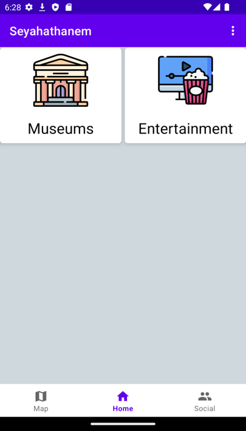
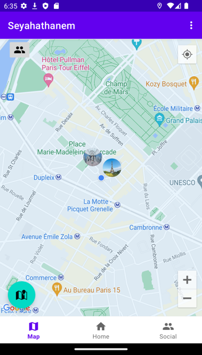
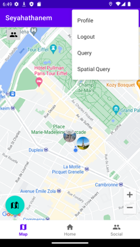
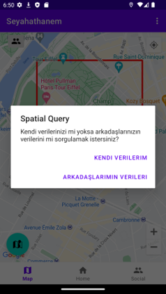
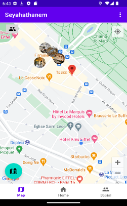
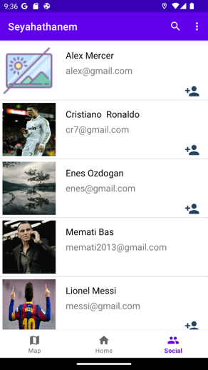
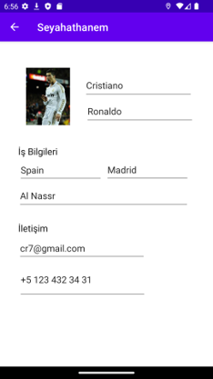

# Seyahathanem

Our project provides a convenient solution for users to record the places they have traveled to and easily access them later. 
It also allows users to establish friendships with other travelers and view their shared experiences on a map through various queries.
This feature enhances the travel experience and makes it more enjoyable.

# Demo

The home screen is the main screen of the user. Here he may see his saves via categories.

  

On the MapsFragment Screen we can see our saved places.

  

The imageButtons seen on the left top and left bottom of the screen are simple queries, query with categories, with your friends' saves as well.
The main thing here, user can do a spatial query, 
- Click Menu

 

- Select Spatial Query Item

After selecting it, first select a soutEast point of the rectangle, then the second northEast point. After all, we are creating a reactangle area
in which we will query our places.

Then, we just following the popup messages,final output looks like

The last Screen is the list of users, user can see their information if they shared it, send friend requests, and contact with them via Email
by long clicking their email textView.

   

# Conclusion
This project has been my first major endeavor, and it undoubtedly contains its fair share of bugs and errors.
Nonetheless, it represents a culmination of all my knowledge and efforts.
It is a project where I have consolidated everything I have learned.
